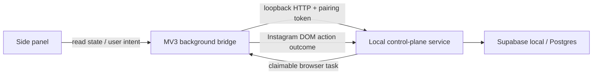

# Local Supabase Control Plane Design

## Goal

Replace the follow-up extension's single JSON blob in `chrome.storage.local`
with a durable local Supabase-backed control plane. The browser extension must
remain the only component that reads or operates Instagram's DOM; the local
service becomes the authoritative scheduler, transaction boundary, and history
store for one local operator and one Instagram account.

## Scope and non-goals

- The first release supports one local operator and one Instagram account.
  Every table nevertheless includes `instagram_account_id`, so a later
  multi-account migration is additive.
- Supabase runs locally on the Mac. No cloud deployment, public API, Meta API,
  Instagram credentials, cookies, or passwords are introduced.
- The service listens on loopback only. It owns the Supabase service role key;
  the extension never receives it.
- This migration preserves the existing Instagram collectors and relationship
  action adapters. It does not alter their DOM selectors or create a new
  Instagram automation capability.
- A private-account result displayed as `Requested` / `Demandé` is represented
  as a durable successful `follow_request_sent` outcome. It is not silently
  treated as a confirmed follow.

## Architecture

The control plane owns scheduling and durable lifecycle state. It emits at
most one claimable browser task per Instagram account. The extension polls for
one task through its existing alarm/background lifecycle, claims it with a
unique task token, performs the existing DOM operation, and submits a
structured outcome. The service records the outcome and determines the next
eligible task in the same transaction.

The extension keeps only a non-authoritative connection configuration in
`chrome.storage.local`: `serviceUrl`, a locally paired bearer token, and a
last-known read cache for rendering while the local service is unavailable.
No scheduler, queue, candidate lifecycle, settings, or action history remains
authoritative in Chrome storage.

## Data model

`instagram_accounts`

- `id uuid primary key`; `normalized_handle text unique`; `created_at` and
  `updated_at` timestamps.

`automation_settings`

- one row per account; current validated timing/backlog settings plus a
  monotonically increasing `revision`.

`automation_runs`

- one row per account; `automation_enabled`, phase, global next-work time,
  source scan and relationship-review times, scheduler lock metadata, and an
  optional unresolved operation fence.

`sources`

- source profile URL and normalized handle, finite queue state, per-source
  limit, collection depth, timestamps, warning, and unique `(account, handle)`.

`candidates`

- unique `(account, normalized_handle)` candidate lifecycle. It stores source
  provenance through the join table; timestamp fields include `followed_at`,
  `follow_back_at`, `follow_back_review_due_at`, `unfollow_due_at`, and
  `unfollowed_at`. Follow-back state is `unknown` or `confirmed`.

`candidate_sources`

- many-to-many source provenance for candidates.

`browser_tasks`

- immutable intent identity, action kind (`source_collection`,
  `relationship_review`, `follow`, `unfollow`), payload, status (`queued`,
  `claimed`, `requires_confirmation`, `completed`, `failed`, `cancelled`),
  claim owner and time, expiration, and result payload.

`action_history`

- append-only evidence of every result. It records the browser-task ID,
  candidate ID when applicable, action, outcome (`succeeded`, `skipped`,
  `failed`, `follow_request_sent`), reason, timestamps, and structured proof.

## Lifecycle and recovery

1. A side-panel command reaches the local service through the background
   bridge. The service validates it, changes state transactionally, and creates
   or wakes the next task if due.
2. The extension claims exactly one queued task. Claiming atomically moves it
   to `claimed`; a second worker cannot claim it.
3. Before a DOM action begins, the extension reports a durable action-start
   marker. It then calls the existing collector or relationship adapter.
4. On a verified result, the extension submits the result with the task ID and
   claim token. The service writes history, candidate/source changes, and the
   next timing fields in one database transaction.
5. If the extension or browser disappears after action-start, the task becomes
   `requires_confirmation`; automatic work does not repeat it. The panel
   exposes the state and a future explicit recovery flow can classify it after
   the user checks Instagram.

All action kinds share one global account lane. A due unfollow, collection,
follow-back review, and direct follow cannot overlap. A user pause or stop
cancels queued tasks and prevents new claims; a task already beyond the DOM
action-start marker stays in confirmation/recovery rather than being rerun.

## Function adaptation

### Source collection and direct follow

The service queues a `source_collection` task with source ID and limit. The
extension opens the existing Followers modal and runs
`collectAndFollowFollowers`. Each verified row result is posted as a child
outcome of that task; a normal follow becomes `followed`, while a private
account request becomes `follow_request_sent` with its own recorded state.

### Follow-back review

The service schedules a `relationship_review` task. The extension uses the
existing own-Followers collector, submits the complete/partial collection
metadata and handles, and the service only marks a candidate confirmed when it
appears in a complete enough collection. A confirmed candidate receives
`unfollow_due_at = follow_back_at + configured delay`; an incomplete result
cannot become negative evidence.

### Unfollow

The service queues an `unfollow` task only when it is the globally eligible
action. The extension retains the current Following-list DOM verification. On
success the candidate becomes `unfollowed`; on a requested private follow a
future cancellation action is deliberately separate from normal unfollow.

### Dashboard and manual controls

The side panel reads a service snapshot for all metrics, sources, history,
work status, and recovery state. Existing controls map to explicit service
commands: add/remove source, start/pause/resume/stop, scan now, follow-back
refresh, settings, export, and reset. The live counter is derived from the
run/task result stream rather than browser-local history.

## Local security and operations

- The local service listens only on `127.0.0.1`; no LAN binding or cloud URL.
- A first-run pairing command creates a random token in a mode-restricted local
  configuration file. The token is configured once in the extension and sent
  in the `Authorization` header to the loopback service.
- The service role key lives only in the ignored local service environment
  file. Browser code uses no Supabase secret.
- Startup health reports: Supabase unavailable, service unavailable, extension
  not paired, and Instagram session unavailable. In each case actions are
  blocked but state remains readable where possible.
- Export produces the same portable logical data set — settings, sources,
  candidates, run, and history — plus schema version; it never exports the
  pairing token or Supabase credentials.

## Migration

1. Start local Supabase and the loopback control-plane service.
2. Apply versioned SQL migrations and seed the one current Instagram account.
3. Ask the extension to export its legacy state, validate it with the existing
   model normalizer, and retain the export as a backup.
4. Import through one idempotent service command. It writes a migration record
   with source checksum, settings, sources, candidate provenance, run state,
   and immutable history.
5. Compare service snapshot against the legacy export. Only when equal does
   the extension switch to remote-authoritative reads/writes. The old local
   state remains untouched for rollback until the user explicitly clears it.

## Verification

- Unit tests validate SQL repository mapping, command validation, task claims,
  idempotent outcomes, global serialisation, recovery after a claimed task,
  migration idempotency, and private-request result mapping.
- Integration tests run Supabase local and the service, exercise the HTTP
  pairing boundary, and prove a concurrent second claim is rejected.
- Extension tests use a fake service transport to prove all existing controls
  send the corresponding command and the panel renders a service snapshot.
- Playwright extension tests load the unpacked extension and local service;
  they do not navigate or act on live Instagram for migration verification.

## Success criteria

1. Restarting the extension or browser does not lose settings, sources,
   candidates, history, scheduling state, or unresolved action state.
2. A single account has no overlapping browser tasks and no automatic replay of
   an action whose browser-side result is unknown.
3. The existing collection, direct follow, follow-back review, and unfollow
   functions continue through their existing Instagram DOM adapters.
4. The panel exposes the same operational controls and reads durable metrics.
5. No Supabase service key, Instagram credential, or cookie enters the
   extension or export.
